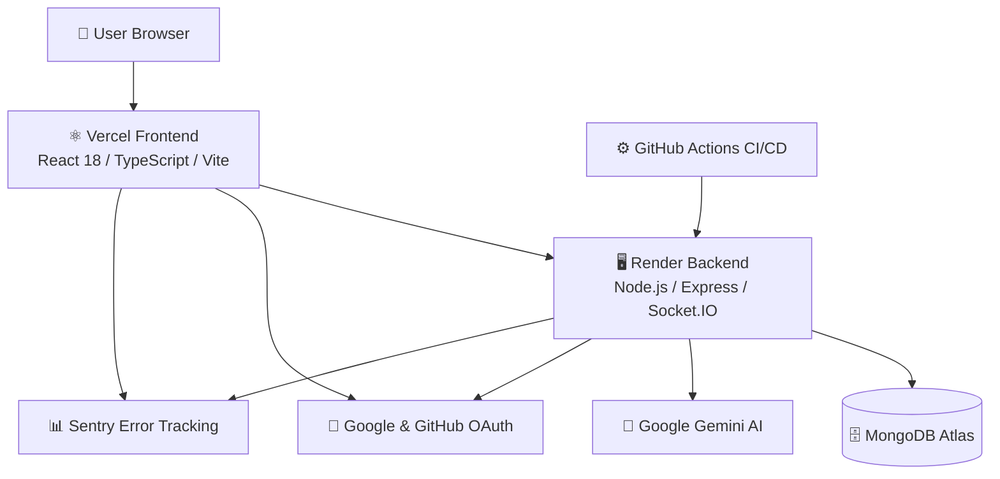

## 🧠 MindSphere — AI-Powered Mental Wellness Platform

> A production-grade, full-stack mental wellness application featuring AI-driven mood analysis, OAuth authentication, real-time community chat, gamified self-care, and comprehensive E2E testing — deployed live on Vercel + Render.

<p align="center">
  <a href="https://mindsphere-hub.vercel.app"></a>
  <a href="https://mindsphere-backend-9c0u.onrender.com/health"></a>
  <a href="https://github.com/ByteForge24/MindSphere/actions"></a>
</p>

<p align="center">
  
</p>

---

## 📋 Table of Contents

- [Overview](#overview)
- [Live Demo](#live-demo)
- [Screenshots](#screenshots)
- [Feature Highlights](#feature-highlights)
- [Features](#features)
- [System Architecture Overview](#system-architecture-overview)
- [Architecture](#architecture)
- [Tech Stack](#tech-stack)
- [Getting Started](#getting-started)
- [Docker Deployment](#docker-deployment)
- [API Documentation](#api-documentation)
- [Project Structure](#project-structure)
- [Testing](#testing)
- [CI/CD Pipeline](#cicd-pipeline)
- [Infrastructure & DevOps](#infrastructure--devops)
- [Security](#security)
- [Future Roadmap](#future-roadmap)
- [Contributing](#contributing)
- [License](#license)

---

## Overview

MindSphere is a **production-grade mental wellness platform** that combines mood tracking, AI-powered insights, real-time community chat, and gamification to help users build healthy mental health habits. It demonstrates:

- **Full-Stack Architecture** — React SPA + Node.js REST API + MongoDB + Socket.IO
- **AI Integration** — Google Gemini 1.5 Flash for mood analysis and personalized suggestions
- **OAuth 2.0** — Google & GitHub social login via Passport.js
- **Real-Time Communication** — Socket.IO with JWT-authenticated WebSocket connections
- **Production Patterns** — Centralized error handling, structured logging (Winston), RBAC, rate limiting, security headers
- **Comprehensive Testing** — 57+ test files across unit, integration, and E2E (Playwright production tests)
- **DevOps** — Docker containerization, 3 CI/CD workflows, Lighthouse audits, bundle size monitoring, automated backend warmup

---

## Live Demo

| Service | URL |
|---------|-----|
| **Frontend** | [https://mindsphere-hub.vercel.app](https://mindsphere-hub.vercel.app) |
| **Backend API** | [https://mindsphere-backend-9c0u.onrender.com](https://mindsphere-backend-9c0u.onrender.com/health) |

> The backend runs on Render's free tier. A GitHub Actions cron job pings it every 5 minutes to prevent cold starts.

---

## Screenshots

### Landing Page


### Register Page


### Mood Check-In


### Community Chat


### Wellness Games


---

## System Architecture Overview

MindSphere follows a modern full-stack architecture:

> **User Browser** → **React Frontend** (Vercel) → **Node.js/Express API** (Render) → **MongoDB Atlas**

External integrations include **Google Gemini** for AI insights and **OAuth providers** (Google and GitHub) for authentication. Real-time community chat is powered by **Socket.IO** with JWT-authenticated WebSocket connections.

---

## Architecture



---

## Feature Highlights

- 🤖 **AI-powered mood insights** using Google Gemini
- 🎯 **Daily emotional check-ins** with streak tracking
- 📔 **Secure journaling** with AI-assisted reflections
- 💬 **Real-time community support chat** (Socket.IO)
- 🎮 **Mindfulness exercises** and breathing games
- 🔐 **OAuth login** (Google & GitHub)

---

## Features

### 🎯 Mood Tracking & Check-In System
- Daily mood (1–10) and energy level check-ins with streak tracking
- Voice and text input support via VoiceRecorder component
- Historical mood visualization with interactive Recharts graphs
- Paginated mood history with filtering
- AI-generated personalized suggestions after each check-in

### 🤖 AI-Powered Insights (Google Gemini)
- Personalized wellness recommendations based on mood input
- AI mood analysis for journal entries
- Dashboard AI insights summarizing weekly trends
- Rate-limited to prevent abuse (20 req/15min per user)

### 📔 Journaling System
- Full CRUD journal with tagging and privacy controls
- AI-powered mood detection on journal entries
- Paginated entries with server-side filtering
- Input validation with express-validator

### 💬 Real-Time Community Chat
- Socket.IO WebSocket with JWT authentication handshake
- Community groups with join/leave and member management
- Persistent message storage with cursor-based pagination
- REST API fallback for message history

### 🌱 Gamification — Plant Growth & Tokens
- Streak-based plant evolution (sprout → leaf → flower → tree)
- Token economy — earn tokens for activities, spend on rewards
- Visual progress tracking on dashboard via PlantGrowthTracker

### 🔐 Authentication & Authorization
- JWT-based auth with 7-day token expiry
- **Google OAuth 2.0** via Passport.js — redirects to accounts.google.com
- **GitHub OAuth 2.0** via Passport.js — redirects to github.com/login/oauth
- OAuthCallbackPage handles provider redirects and token exchange
- Role-Based Access Control (RBAC) — student, professional, admin, moderator
- Protected routes on both frontend (`ProtectedRoute`) and backend
- Secure password hashing with bcryptjs
- **Role selection UI** with persistent visual highlight (border, background, ring, checkmark icon)

### 🎮 Wellness Games
- Deep Breathing Exercise with guided phases (inhale, hold, exhale)
- Visual progress bars (current phase + overall progress)
- Cycle counter (3 cycles per session)
- Start/Pause/Resume/Reset controls

### 📊 Dashboard & Analytics
- Aggregated user statistics (streaks, check-ins, journals, tokens)
- AI-generated weekly insights
- MoodChart with time-range selection
- Real-time data with TanStack React Query caching

### 👤 Profile Management
- Full Name, Email (read-only), Role dropdown
- About You and Goals & Interests textarea fields
- Theme toggle (light/dark/system)
- Notification and privacy settings
- Save All Changes with toast confirmation

---

## Tech Stack

| Layer | Technology |
|-------|-----------|
| **Frontend** | React 18, TypeScript, Vite (SWC), TanStack React Query, React Router v6 |
| **UI** | Tailwind CSS, Radix UI (50+ accessible primitives), shadcn/ui, Lucide Icons, Recharts |
| **State/Forms** | React Context, React Hook Form, Zod validation |
| **Backend** | Node.js, Express 4, Socket.IO 4, JWT, Passport.js |
| **OAuth** | Google OAuth 2.0, GitHub OAuth 2.0 (via passport-google-oauth20, passport-github2) |
| **Security** | Helmet, CORS (strict origin allowlist), Rate Limiting, bcryptjs, RBAC middleware |
| **Validation** | express-validator (server), Zod (client) |
| **Database** | MongoDB Atlas, Mongoose ODM |
| **AI** | Google Gemini 1.5 Flash via @google/genai |
| **Logging** | Winston (structured, file + console transports) |
| **Error Tracking** | Sentry (frontend @sentry/react + backend @sentry/node) |
| **Testing** | Jest + Supertest (backend), Vitest + Testing Library (frontend), Playwright (E2E + production) |
| **CI/CD** | GitHub Actions (3 workflows — deploy, Playwright, warmup) |
| **Performance** | Lighthouse CI (a11y ≥ 0.9, perf ≥ 0.7, SEO ≥ 0.8), bundlewatch |
| **Deployment** | Vercel (frontend), Render (backend), Docker + Docker Compose (local) |
| **Infrastructure** | GitHub Actions cron warmup (every 5 min), Render auto-deploy |

---

## Getting Started

### Prerequisites
- Node.js 18+
- MongoDB (local or Atlas connection string)
- Google Gemini API key ([Get one here](https://ai.google.dev/))
- OAuth credentials (optional): Google Cloud Console + GitHub Developer Settings

### Installation

```bash
# Clone the repository
git clone https://github.com/ByteForge24/MindSphere.git
cd MindSphere

# Install all dependencies (root + backend + frontend)
npm install
cd backend && npm install && cd ..
cd frontend && npm install && cd ..
```

### Environment Setup

Create `backend/.env`:
```env
PORT=5000
MONGO_URI=mongodb://localhost:27017/mindsphere
JWT_SECRET=your_jwt_secret_here
GEMINI_API_KEY=your_gemini_api_key
FRONTEND_URL=http://localhost:8080
BASE_URL=http://localhost:5000

# OAuth (optional)
GOOGLE_CLIENT_ID=your_google_client_id
GOOGLE_CLIENT_SECRET=your_google_client_secret
GITHUB_CLIENT_ID=your_github_client_id
GITHUB_CLIENT_SECRET=your_github_client_secret

# Optional
SENTRY_DSN=
LOG_LEVEL=info
NODE_ENV=development
```

Create `frontend/.env`:
```env
VITE_API_URL=http://localhost:5000/api
VITE_BACKEND_URL=http://localhost:5000
```

### Run Development Servers

```bash
# From project root — starts both frontend and backend concurrently
npm run dev
```

The frontend runs at `http://localhost:8080` and the backend API at `http://localhost:5000`.

---

## Docker Deployment

```bash
# Copy environment template
cp .env.example .env
# Edit .env with your secrets

# Build and start all services
docker compose up -d --build

# View logs
docker compose logs -f backend

# Stop
docker compose down
```

Services:
| Service | Container | Port | Details |
|---------|-----------|------|---------|
| **Frontend** | Nginx (multi-stage build) | `80` | Production SPA served via nginx:alpine |
| **Backend** | Node 20 Alpine | `5000` | Health check on `/health`, non-root user |
| **MongoDB** | Mongo 7 | `27017` | Named volume `mongo_data` for persistence |

---

## API Documentation

### Authentication
| Method | Endpoint | Description |
|--------|----------|-------------|
| POST | `/api/auth/register` | Register new user (name, email, password, role) |
| POST | `/api/auth/login` | Login and receive JWT |
| GET | `/api/auth/google` | Initiate Google OAuth 2.0 flow |
| GET | `/api/auth/google/callback` | Google OAuth callback |
| GET | `/api/auth/github` | Initiate GitHub OAuth 2.0 flow |
| GET | `/api/auth/github/callback` | GitHub OAuth callback |

### Mood Tracking
| Method | Endpoint | Description |
|--------|----------|-------------|
| POST | `/api/mood/check-in` | Submit mood check-in (mood, energy, text) |
| GET | `/api/mood/history` | Get paginated mood history |
| POST | `/api/mood/suggestions` | Get AI suggestions (rate-limited) |

### Journal
| Method | Endpoint | Description |
|--------|----------|-------------|
| GET | `/api/journal` | List journal entries (paginated) |
| POST | `/api/journal` | Create journal entry |
| PUT | `/api/journal/:id` | Update journal entry |
| DELETE | `/api/journal/:id` | Delete journal entry |

### Community
| Method | Endpoint | Description |
|--------|----------|-------------|
| GET | `/api/community` | List community groups |
| POST | `/api/community` | Create group |
| POST | `/api/community/:id/join` | Join group |
| POST | `/api/community/:id/leave` | Leave group |

### Messages (REST + WebSocket)
| Method | Endpoint | Description |
|--------|----------|-------------|
| GET | `/api/messages/:communityId` | Get messages (cursor pagination) |
| POST | `/api/messages` | Send message |
| WS | `socket.io` | Real-time messaging with JWT auth |

### Dashboard & Profile
| Method | Endpoint | Description |
|--------|----------|-------------|
| GET | `/api/dashboard/stats` | Dashboard statistics |
| GET | `/api/dashboard/ai-insight` | AI-generated weekly insight (rate-limited) |
| GET | `/api/users/profile` | Get user profile |
| PUT | `/api/users/profile` | Update profile |

### Tokens, Plants & Recommendations
| Method | Endpoint | Description |
|--------|----------|-------------|
| GET | `/api/tokens` | Token transaction history |
| POST | `/api/tokens` | Add/spend tokens |
| GET | `/api/plants/growth` | Plant growth status |
| GET | `/api/recommendations` | AI wellness recommendations |

### Health Check
| Method | Endpoint | Description |
|--------|----------|-------------|
| GET | `/health` | Returns `OK` (used by Render + warmup cron) |

### Request / Response Examples

<details>
<summary><strong>POST /api/auth/register</strong></summary>

**Request:**
```json
{
  "name": "Jane Doe",
  "email": "jane@example.com",
  "password": "securePassword123",
  "role": "student"
}
```

**Response:**
```json
{
  "token": "eyJhbGciOiJIUzI1NiIsInR5cCI6IkpXVCJ9...",
  "user": {
    "id": "665f1a2b3c4d5e6f7a8b9c0d",
    "name": "Jane Doe",
    "email": "jane@example.com",
    "role": "student",
    "createdAt": "2026-03-10T12:00:00.000Z"
  }
}
```
</details>

<details>
<summary><strong>POST /api/mood/check-in</strong></summary>

**Headers:** `Authorization: Bearer <JWT_TOKEN>`

**Request:**
```json
{
  "moodScore": 7,
  "energyLevel": 6,
  "method": "text",
  "text": "Feeling good today after a morning walk."
}
```

**Response:**
```json
{
  "checkIn": {
    "_id": "665f1b3c4d5e6f7a8b9c0e1f",
    "user": "665f1a2b3c4d5e6f7a8b9c0d",
    "moodScore": 7,
    "energyLevel": 6,
    "method": "text",
    "text": "Feeling good today after a morning walk.",
    "createdAt": "2026-03-10T12:05:00.000Z"
  },
  "streak": {
    "count": 5,
    "lastCheckIn": "2026-03-10T12:05:00.000Z",
    "plantLevel": "leaf"
  }
}
```
</details>

<details>
<summary><strong>POST /api/journal</strong></summary>

**Headers:** `Authorization: Bearer <JWT_TOKEN>`

**Request:**
```json
{
  "title": "Morning Reflection",
  "content": "Today I practiced gratitude and felt more centered.",
  "tags": ["gratitude", "morning"],
  "isPrivate": true
}
```

**Response:**
```json
{
  "success": true,
  "data": {
    "_id": "665f1c4d5e6f7a8b9c0d1e2f",
    "user": "665f1a2b3c4d5e6f7a8b9c0d",
    "title": "Morning Reflection",
    "content": "Today I practiced gratitude and felt more centered.",
    "mood": "positive",
    "tags": ["gratitude", "morning"],
    "isPrivate": true,
    "createdAt": "2026-03-10T12:10:00.000Z",
    "updatedAt": "2026-03-10T12:10:00.000Z"
  },
  "message": "Journal entry created"
}
```
</details>

---

## Project Structure

```
MindSphere/
├── .github/workflows/
│   ├── deploy.yml              # CI/CD deployment pipeline
│   ├── playwright.yml          # Playwright + Lighthouse + bundle check
│   └── warmup.yml              # Backend warmup cron (every 5 min)
│
├── scripts/
│   └── warmup.js               # Backend health ping script
│
├── tests/prod/                 # Production E2E tests (Playwright)
│   ├── playwright.config.ts    # Config: Vercel URL, retries, chromium
│   ├── helpers.ts              # Shared login, URLs, test user
│   ├── signup.spec.ts          # Role selection UI + signup per role (6 tests)
│   ├── login.spec.ts           # Valid login + invalid credentials (2 tests)
│   ├── oauth-google.spec.ts    # Google OAuth redirect (with warmup)
│   ├── oauth-github.spec.ts    # GitHub OAuth redirect (with warmup)
│   ├── navigation.spec.ts      # All 7 sidebar links
│   ├── checkin.spec.ts         # Mood/energy sliders + submit
│   ├── journal.spec.ts         # Create entry + verify persistence
│   ├── history.spec.ts         # Mood analytics + charts
│   ├── community.spec.ts       # Community chat + New Group
│   ├── games.spec.ts           # Breathing exercise + progress
│   ├── profile.spec.ts         # Form fields + save
│   └── logout.spec.ts          # Logout + redirect
│
├── backend/
│   ├── server.js               # Express app entry + Socket.IO + OAuth
│   ├── Dockerfile              # Node 20 Alpine container
│   ├── Procfile                # Render deploy command
│   ├── middleware/
│   │   ├── auth.js             # JWT authentication
│   │   └── errorHandler.js     # Centralized error handling
│   ├── models/                 # Mongoose schemas (8 models)
│   │   ├── User.js             # name, email, password, role, OAuth fields
│   │   ├── CheckIn.js          # mood, energy, text, streaks
│   │   ├── Journal.js          # title, content, tags, privacy
│   │   ├── Community.js        # groups, members
│   │   ├── Group.js            # group metadata
│   │   ├── Token.js            # token transactions
│   │   ├── Reward.js           # redeemable rewards
│   │   └── Recommendation.js   # AI recommendations
│   ├── routes/                 # Express route handlers (11 files)
│   │   ├── auth.js             # Register, login, OAuth callbacks
│   │   ├── mood.js             # Check-in, history
│   │   ├── geminiMood.js       # AI mood analysis
│   │   ├── journal.js          # CRUD with pagination
│   │   ├── community.js        # Group management
│   │   ├── dashboard.js        # Stats + AI insights
│   │   ├── users.js            # Profile CRUD
│   │   ├── tokens.js           # Token operations
│   │   ├── plants.js           # Plant growth
│   │   ├── recommendations.js  # AI recommendations
│   │   └── group.js            # Group routes
│   ├── services/
│   │   └── geminiService.js    # Google Gemini AI integration
│   ├── scripts/
│   │   └── seedData.js         # Database seeder
│   └── tests/                  # Jest + Supertest (6 test files)
│       ├── auth.test.js
│       ├── mood.test.js
│       ├── journal.test.js
│       ├── community.test.js
│       ├── dashboard-tokens.test.js
│       └── users.test.js
│
├── frontend/
│   ├── Dockerfile              # Multi-stage: build → nginx:alpine
│   ├── vercel.json             # SPA rewrites for Vercel deployment
│   ├── vite.config.ts          # Vite + SWC, port 8080
│   └── src/
│       ├── pages/              # 13 route pages
│       │   ├── Index.tsx               # Landing page
│       │   ├── LoginPage.tsx           # Email/password + OAuth buttons
│       │   ├── RegisterPage.tsx        # Signup with role selection UI
│       │   ├── OAuthCallbackPage.tsx   # OAuth redirect handler
│       │   ├── DashboardPage.tsx       # Stats, plant, mood chart
│       │   ├── CheckInPage.tsx         # Mood/energy sliders + AI insights
│       │   ├── JournalPage.tsx         # Journal list + create/edit
│       │   ├── HistoryPage.tsx         # Mood analytics + charts
│       │   ├── CommunityPage.tsx       # Chat + groups
│       │   ├── GamesPage.tsx           # Breathing exercise
│       │   ├── ProfilePage.tsx         # Settings + save
│       │   ├── Analytics.tsx           # Analytics dashboard
│       │   └── NotFound.tsx            # 404 page
│       ├── components/         # 13 custom components + 50 UI primitives
│       │   ├── DashboardLayout.tsx     # Sidebar nav (7 items) + layout
│       │   ├── CommunityChat.tsx       # Real-time chat with groups
│       │   ├── MoodChart.tsx           # Recharts line chart
│       │   ├── PlantGrowthTracker.tsx  # Gamified plant visual
│       │   ├── VoiceRecorder.tsx       # Audio recording
│       │   ├── RecommendationCards.tsx # AI suggestion cards
│       │   ├── ProtectedRoute.tsx      # Auth route guard
│       │   ├── ThemeToggle.tsx         # Dark/light mode
│       │   ├── games/
│       │   │   └── BreathingGame.tsx   # Guided breathing exercise
│       │   └── ui/                     # 50 shadcn/ui primitives
│       ├── context/
│       │   └── AuthContext.tsx  # Auth state, login, register, OAuth
│       ├── hooks/              # Custom hooks
│       │   ├── useAiService.ts
│       │   ├── useTheme.ts
│       │   ├── use-toast.ts
│       │   └── use-mobile.tsx
│       ├── services/           # API service layer
│       │   ├── recommendationService.ts
│       │   └── socket.ts
│       └── lib/                # Utilities
│           ├── api.ts          # Axios instance
│           ├── env.ts          # Environment helpers
│           └── utils.ts        # cn() utility
│
├── docker-compose.yml          # 3-service stack (mongo, backend, frontend)
├── render.yaml                 # Render deployment config
├── amplify.yml                 # AWS Amplify config
├── lighthouserc.json           # Lighthouse CI thresholds
├── SECURITY.md                 # Security policy & incident response
└── package.json                # Root scripts, Playwright, concurrently
```

---

## Testing

### Test Summary

| Category | Files | Tests | Framework |
|----------|-------|-------|-----------|
| **Backend Unit/Integration** | 6 | ~50 | Jest + Supertest + mongodb-memory-server |
| **Frontend Unit** | 32 | ~86 | Vitest + Testing Library |
| **Frontend E2E** | 7 | ~36 | Playwright (local) |
| **Production E2E** | 12 | 18 | Playwright (against live Vercel + Render) |
| **Total** | **57** | **~190** | — |

### Running Tests

```bash
# Backend tests (Jest + Supertest, uses in-memory MongoDB)
cd backend && npm test

# Frontend unit tests (Vitest + Testing Library)
cd frontend && npx vitest run

# Frontend E2E tests (Playwright, local)
cd frontend && npx playwright test

# Production E2E tests (against deployed site)
npm run test:prod          # headed mode (visible browser)
npm run test:prod:ci       # headless mode (CI)
```

### Production E2E Test Suite

The production E2E suite runs 18 tests across 12 spec files against the live deployed site:

| Spec File | Tests | What It Validates |
|-----------|-------|-------------------|
| `signup.spec.ts` | 6 | Role selection UI highlight (student/professional/other) + full signup flow per role |
| `login.spec.ts` | 2 | Valid login with dashboard redirect + invalid credentials error toast |
| `oauth-google.spec.ts` | 1 | Google OAuth → redirect to accounts.google.com (with backend warmup) |
| `oauth-github.spec.ts` | 1 | GitHub OAuth → redirect to github.com (with backend warmup) |
| `navigation.spec.ts` | 1 | All 7 sidebar links (Dashboard, Check-In, Journal, History, Community, Games, Profile) |
| `checkin.spec.ts` | 1 | Mood/energy sliders, text input, submit + success toast |
| `journal.spec.ts` | 1 | Create entry, verify it persists after reload |
| `history.spec.ts` | 1 | Mood History Analytics, chart rendering, key metrics |
| `community.spec.ts` | 1 | Wellness Community badge, Community Chat, New Group button |
| `games.spec.ts` | 1 | Breathing exercise, progress bars, cycle counter, Start button |
| `profile.spec.ts` | 1 | Form fields, email disabled, update bio, save with toast |
| `logout.spec.ts` | 1 | Logout + redirect to /login |

**Key testing features:**
- `data-testid` attributes for reliable role selection testing
- `toHaveClass(/selected/)` assertion for visual feedback verification
- Backend warmup pings before OAuth tests to prevent Render cold-start failures
- Configurable retries: 2 in CI, 1 locally (OAuth tests always retry 2×)
- Screenshots, video, and trace captured on failure

---

## CI/CD Pipeline

### 3 GitHub Actions Workflows

#### 1. `deploy.yml` — CI/CD Deployment Pipeline
**Trigger:** Push to `main`
- Secret scanning (blocks hardcoded API keys)
- MongoDB service container
- Install dependencies (root + frontend + backend)
- Start backend with health-check retries
- Install Playwright browsers
- Generate & commit visual regression baselines
- Run Playwright E2E tests

#### 2. `playwright.yml` — Playwright + Quality Gates
**Trigger:** Push to `main`/`testing`, PRs to `main`
- Everything in deploy pipeline, plus:
- **Lighthouse CI** audits on 4 pages (`/`, `/login`, `/signup`, `/dashboard`)
  - Accessibility ≥ 0.9 (error), Performance ≥ 0.7, Best Practices ≥ 0.8, SEO ≥ 0.8
- **Bundle size monitoring** via bundlewatch
- Frontend production build verification
- Artifact uploads (Playwright report + Lighthouse report, 30-day retention)

#### 3. `warmup.yml` — Backend Warmup Cron
**Trigger:** Every 5 minutes (`*/5 * * * *`) + manual dispatch
- Pings `https://mindsphere-backend-9c0u.onrender.com/health`
- Prevents Render free-tier cold starts

### Pipeline Security
- Both CI workflows include **secret scanning** that greps for patterns like `AIza...`, `sk-...`, `ghp_...`, `AKIA...` and fails the build if found

---

## Infrastructure & DevOps

### Deployment Architecture

```
GitHub (main branch)
  ├── Push triggers Vercel auto-deploy (frontend)
  ├── Push triggers Render auto-deploy (backend via render.yaml)
  └── GitHub Actions runs tests + Lighthouse + bundle check

Vercel (Frontend)
  ├── SPA with vercel.json rewrites (all routes → /index.html)
  └── Environment: VITE_BACKEND_URL → Render backend

Render (Backend)
  ├── Node.js web service (render.yaml)
  ├── MongoDB Atlas connection
  └── OAuth callbacks configured for production URLs

GitHub Actions Cron (every 5 min)
  └── cURL ping to /health keeps Render awake
```

### Backend Warmup

The Render free tier spins down after inactivity. Two mechanisms keep it warm:

1. **GitHub Actions cron** (`.github/workflows/warmup.yml`) — pings `/health` every 5 minutes
2. **In-test warmup** — OAuth E2E tests call `beforeAll` to warm up the backend before testing redirect flows

Local warmup script:
```bash
node scripts/warmup.js
# → [warmup] 2026-03-10T07:18:24.869Z — Backend status: 200
```

### CORS Configuration

The backend allows these origins:
- `https://mindsphere-hub.vercel.app` (production frontend)
- `https://mindsphere-ai.netlify.app` (legacy frontend)
- `http://localhost:3000`, `http://localhost:8080` (development)

---

## Security

- **Helmet** — HTTP security headers (CSP, HSTS, XSS protection)
- **CORS** — Strict origin allowlist (4 origins)
- **Rate Limiting** — AI endpoints limited to 20 req/15min per user
- **JWT Authentication** — Stateless token-based auth with 7-day expiry
- **OAuth 2.0** — Google & GitHub social login via Passport.js (no passwords stored for OAuth users)
- **RBAC Middleware** — Role-based route protection (student, professional, admin, moderator)
- **express-validator** — Server-side input validation on all mutation endpoints
- **bcryptjs** — Password hashing with salt rounds
- **Secret Scanning** — CI pipeline scans every push for leaked credentials
- **Sentry** — Frontend + backend error tracking and monitoring
- **Docker Security** — Non-root user (`appuser`) in backend container, multi-stage frontend build

See [SECURITY.md](SECURITY.md) for the full security policy and incident response procedures.

---

## Future Roadmap

- [ ] Redis caching layer for high-traffic endpoints
- [ ] Swagger/OpenAPI auto-generated documentation
- [ ] Password reset flow with email verification
- [ ] Push notifications for streaks and community activity
- [ ] Full-text search across journals and communities
- [ ] Data export (GDPR compliance)
- [ ] AI chatbot for guided wellness conversations
- [ ] Mobile-responsive PWA with offline support
- [ ] More wellness games (meditation timer, gratitude prompts)
- [ ] Group video sessions for community support

---

## 👨‍💻 Resume-Level Project Description

> **MindSphere** — Engineered a production-grade, full-stack AI-powered mental wellness platform deployed on Vercel + Render. Built with React 18/TypeScript (Vite), Node.js/Express, MongoDB Atlas, and Socket.IO for real-time community chat. Integrated Google Gemini AI for personalized mood analysis and wellness recommendations. Implemented Google & GitHub OAuth 2.0 via Passport.js alongside JWT authentication with RBAC. Achieved 190+ automated tests across 57 test files — including 18 Playwright E2E tests running against the live production deployment with role-selection UI verification, OAuth redirect validation, and backend warm-up strategies. CI/CD pipeline includes 3 GitHub Actions workflows with secret scanning, Lighthouse CI audits (accessibility ≥ 0.9), and bundle size monitoring. Containerized with Docker Compose (3 services). Infrastructure includes automated cron-based backend warmup to eliminate Render cold starts.

---

## Contributing

Contributions are welcome!

1. **Fork** the repository
2. **Create** a feature branch (`git checkout -b feature/amazing-feature`)
3. **Commit** your changes (`git commit -m 'feat: add amazing feature'`)
4. **Push** to the branch (`git push origin feature/amazing-feature`)
5. **Open** a Pull Request

Please follow existing project coding standards and ensure all tests pass before submitting.

---

## License

This project is licensed under the [MIT License](LICENSE).
